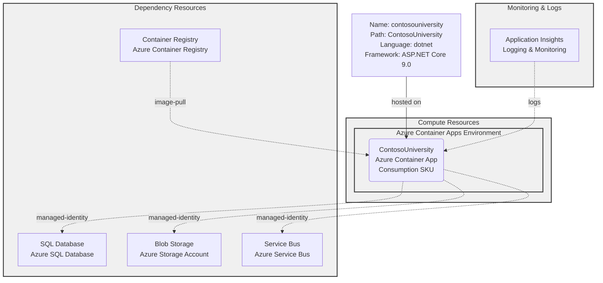

# Azure Container Apps Deployment Plan - ContosoUniversity

## **Goal**
Deploy the ContosoUniversity .NET 9.0 ASP.NET Core application to Azure Container Apps using AzCLI with Bicep Infrastructure as Code. The application will be containerized and deployed with managed identity authentication to Azure SQL Database and Azure Blob Storage.

## **Project Information**

**ContosoUniversity**
- **Stack**: ASP.NET Core 9.0 (MVC)
- **Type**: University management web application with course enrollment, student, and instructor management
- **Containerization**: Dockerfile (multi-stage build with security best practices)
- **Key Dependencies**: 
  - Entity Framework Core 9.0 (Azure SQL Database)
  - Azure Blob Storage (Teaching materials)
  - Azure Service Bus (Notifications)
  - Managed Identity authentication
- **Hosting**: Azure Container Apps
- **Port**: 8080 (configured for Container Apps)
- **Language**: .NET 9.0
- **Build Tool**: dotnet CLI

## **Azure Resources Architecture**



## **Existing Azure Resources**

> **Note**: The deployment plan assumes Azure resources may already exist from previous infrastructure provisioning tasks. Update this section based on actual resource availability in your Azure subscription.

| Resource Type | Name | SKU | Purpose | Status |
|---------------|------|-----|---------|--------|
| Azure Container Apps Environment | *to-be-determined* | Consumption | Hosting Container App | TBD |
| Azure Container Registry | *to-be-determined* | Standard | Storing Docker images | TBD |
| Azure SQL Database | *to-be-determined* | Standard | Application database | TBD |
| Azure Storage Account | *to-be-determined* | Standard_LRS | Blob storage for teaching materials | TBD |
| Azure Service Bus | *to-be-determined* | Standard | Message queueing for notifications | TBD |
| Log Analytics Workspace | *to-be-determined* | Pay-As-You-Go | Application logs & monitoring | TBD |
| Managed Identity | *to-be-determined* | N/A | Passwordless authentication | TBD |

**Missing Resources**: All resources listed above need to be verified or provisioned.

## **Execution Steps**

### **Step 1: Containerization** ☐

**Objective**: Ensure Docker artifacts (Dockerfile and .dockerignore) are ready for building the container image.

**Sub-steps**:
- [x] Dockerfile exists at: `./Dockerfile`
- [x] Multi-stage build configured with:
  - Build stage: mcr.microsoft.com/dotnet/sdk:9.0
  - Runtime stage: mcr.microsoft.com/dotnet/aspnet:9.0
  - Non-root user (aspnetuser, UID 1001)
  - Port 8080 configured
  - Health check configured
- [ ] .dockerignore file created (if missing)
- [ ] Docker image build and test locally (optional)

**Output**: Ready-to-build Docker artifacts

---

### **Step 2: Environment Setup for AzCLI** ☐

**Objective**: Prepare local environment with Azure CLI and configure subscription access.

**Sub-steps**:
1. [ ] Verify Azure CLI is installed: `az --version`
2. [ ] Verify Azure subscription access: `az account show`
3. [ ] Set default subscription if needed: `az account set --subscription <SUBSCRIPTION_ID>`
4. [ ] Install Service Connector extension: `az extension add --name serviceconnector-passwordless --upgrade`
5. [ ] Verify azcli login for Docker registry (if using ACR): `az acr login --name <ACR_NAME>`

**Required Variables**:
- **SUBSCRIPTION_ID**: Azure subscription ID
- **RESOURCE_GROUP**: Azure resource group name
- **REGION**: Azure region (e.g., eastus, westus2)
- **ACR_NAME**: Azure Container Registry name
- **ACA_ENV_NAME**: Container Apps Environment name
- **ACA_APP_NAME**: Container App name

**Output**: Authenticated AzCLI environment ready for deployment

---

### **Step 3: Provisioning (Infrastructure as Code)** ☐

**Objective**: Provision missing Azure resources using Bicep infrastructure-as-code.

**Sub-steps**:
1. [ ] Identify missing resources using Azure CLI queries
2. [ ] Generate Bicep IaC files using `infrastructure-bicep-generation` skill
3. [ ] Review generated Bicep files for correctness
4. [ ] Deploy infrastructure: `az deployment group create --resource-group <RG> --template-file <BICEP_FILE> --parameters <PARAMS>`
5. [ ] Verify all resources are created: `az resource list --resource-group <RG>`

**Expected Bicep Files**:
- main.bicep
- modules/containerapp.bicep
- modules/sql.bicep
- modules/storage.bicep
- modules/servicebus.bicep
- modules/containerregistry.bicep
- modules/loganalytics.bicep

**Output**: All required Azure resources provisioned and ready

---

### **Step 4: Check Azure Resources Existence** ☐

**Objective**: Verify all required Azure resources exist and are in a ready state.

**Resource Verification Checklist**:

#### **Azure Container Apps**
- [ ] Container Apps Environment exists
  - Command: `az containerapp env show --name <ENV_NAME> --resource-group <RG> -o json`
  - Check: `provisioningState = "Succeeded"`
  - Check: `properties.defaultDomain` is populated
- [ ] Container App `contosouniversity` ready to deploy
  - Command: `az containerapp list --resource-group <RG>`

#### **Azure Container Registry (ACR)**
- [ ] ACR exists and is accessible
  - Command: `az acr show --name <ACR_NAME> --resource-group <RG> -o json`
  - Check: `provisioningState = "Succeeded"`
  - Note login server: `loginServer` value

#### **Azure SQL Database**
- [ ] SQL Server exists
  - Command: `az sql server show --name <SERVER_NAME> --resource-group <RG> -o json`
- [ ] SQL Database exists
  - Command: `az sql db show --server <SERVER_NAME> --name <DB_NAME> --resource-group <RG> -o json`
  - Check: `status = "Online"`
- [ ] Firewall rules allow Azure services
  - Command: `az sql server firewall-rule list --server <SERVER_NAME> --resource-group <RG>`

#### **Azure Blob Storage**
- [ ] Storage Account exists
  - Command: `az storage account show --name <ACCOUNT_NAME> --resource-group <RG> -o json`
- [ ] Blob Container exists
  - Command: `az storage container list --account-name <ACCOUNT_NAME> --auth-mode login`

#### **Azure Service Bus**
- [ ] Namespace exists
  - Command: `az servicebus namespace show --name <NAMESPACE> --resource-group <RG> -o json`
- [ ] Queue exists
  - Command: `az servicebus queue list --namespace-name <NAMESPACE> --resource-group <RG>`

#### **Managed Identity**
- [ ] User-assigned managed identity exists (optional, or use system-assigned)
  - Command: `az identity show --name <IDENTITY_NAME> --resource-group <RG>`
- [ ] Role assignments configured for dependencies

#### **Log Analytics**
- [ ] Log Analytics Workspace exists
  - Command: `az monitor log-analytics workspace show --workspace-name <WS_NAME> --resource-group <RG> -o json`

**Action if Missing**: If any resource is missing or not ready, use the provisioning step (Step 3) to create or update it.

---

### **Step 5: Deployment to Azure Container Apps** ☐

**Objective**: Build Docker image, push to ACR, and deploy to Azure Container Apps.

**Sub-steps**:

#### **5.1: Build and Push Docker Image to ACR**
- [ ] Build image locally or via ACR:
  ```bash
  az acr build --registry <ACR_NAME> --image contosouniversity:latest .
  ```
  - Alternative (local build): `docker build -t contosouniversity:latest .`
  - Push: `docker tag contosouniversity:latest <ACR_LOGIN_SERVER>/contosouniversity:latest`
  - Push: `docker push <ACR_LOGIN_SERVER>/contosouniversity:latest`

#### **5.2: Create or Update Container App**
- [ ] Prepare environment variables for the Container App:
  - **ASPNETCORE_ENVIRONMENT**: Production
  - **ConnectionStrings__DefaultConnection**: Connection string to Azure SQL Database with managed identity auth
  - **AzureStorage__ServiceUri**: Azure Storage account blob endpoint
  - **AzureServiceBus__FullyQualifiedNamespace**: Service Bus namespace FQDN
  - Other application-specific variables from appsettings.json

- [ ] Create Container App using AzCLI:
  ```bash
  az containerapp create \
    --name contosouniversity \
    --resource-group <RESOURCE_GROUP> \
    --environment <CONTAINER_APP_ENV_NAME> \
    --image <ACR_LOGIN_SERVER>/contosouniversity:latest \
    --target-port 8080 \
    --cpu 0.5 \
    --memory 1Gi \
    --min-replicas 1 \
    --max-replicas 3 \
    --registry-server <ACR_LOGIN_SERVER> \
    --registry-username <ACR_USERNAME> \
    --registry-password <ACR_PASSWORD> \
    --env-vars \
      ASPNETCORE_ENVIRONMENT=Production \
      AzureStorage__ServiceUri=https://<STORAGE_ACCOUNT>.blob.core.windows.net \
      AzureServiceBus__FullyQualifiedNamespace=<NAMESPACE>.servicebus.windows.net
  ```

- [ ] Or update existing Container App:
  ```bash
  az containerapp update \
    --name contosouniversity \
    --resource-group <RESOURCE_GROUP> \
    --image <ACR_LOGIN_SERVER>/contosouniversity:latest
  ```

#### **5.3: Configure Managed Identity and RBAC**
- [ ] Enable system-assigned managed identity on Container App
- [ ] Assign roles for database, storage, and service bus access:
  - SQL Database: `db_datareader`, `db_datawriter` roles
  - Blob Storage: `Storage Blob Data Contributor` role
  - Service Bus: `Azure Service Bus Data Sender`, `Azure Service Bus Data Receiver` roles

#### **5.4: Verify Deployment**
- [ ] Check Container App status:
  ```bash
  az containerapp show --name contosouniversity --resource-group <RG> -o json
  ```
  - Check: `properties.provisioningState = "Succeeded"`
  - Check: `properties.runningStatus = "Running"`
- [ ] Get application URL:
  ```bash
  az containerapp show --name contosouniversity --resource-group <RG> --query properties.latestRevisionFqdn -o tsv
  ```
- [ ] Test application accessibility: `curl https://<APP_URL>`

**Output**: Container App deployed and running

---

### **Step 6: Deployment Validation** ☐

**Objective**: Verify the deployed application is functioning correctly through logs and health checks.

**Sub-steps**:
1. [ ] Retrieve application logs:
   - Use `appmod-get-app-logs` tool to fetch Container App logs
   - Verify no critical errors in startup logs
2. [ ] Check health endpoint (if implemented):
   ```bash
   curl -X GET https://<APP_URL>/health
   ```
3. [ ] Verify database connectivity in logs
4. [ ] Verify Azure Blob Storage connectivity in logs
5. [ ] Monitor application performance and resource usage:
   ```bash
   az monitor metrics list --resource /subscriptions/<SUB_ID>/resourceGroups/<RG>/providers/Microsoft.App/containerApps/contosouniversity --metric "Requests"
   ```

**Output**: Validation confirms successful deployment

---

### **Step 7: Summarize Deployment Result** ☐

**Objective**: Document deployment results using the appmod-summarize-result tool.

**Sub-steps**:
1. [ ] Gather deployment metrics:
   - Deployment status (success/failure)
   - Created files (Dockerfile, Bicep files, deployment scripts)
   - Provisioned resource types
   - Number of deployment attempts
2. [ ] Execute `appmod-summarize-result` tool
3. [ ] Generate deployment summary file: `deployment-summary.md`

**Output**: Comprehensive deployment summary and documentation

---

## **Progress Tracking**

Progress is tracked in `progress.md` file. Update after completing each step:

```
## Deployment Progress: ContosoUniversity → Azure Container Apps

**Task ID**: 006-deployment-container-apps
**Status**: In Progress

### Step 1: Containerization
- [x] Dockerfile created and validated
- [ ] .dockerignore created
- [ ] Docker image build tested

### Step 2: Environment Setup
- [ ] Azure CLI verified
- [ ] Subscription configured
- [ ] Service Connector extension installed

### Step 3: Provisioning
- [ ] Resource group identified
- [ ] Bicep files generated
- [ ] Infrastructure deployed

### Step 4: Resource Verification
- [ ] Container Apps Environment verified
- [ ] Container Registry verified
- [ ] SQL Database verified
- [ ] Storage Account verified
- [ ] Service Bus verified
- [ ] Managed Identity verified
- [ ] Log Analytics verified

### Step 5: Deployment
- [ ] Docker image built and pushed
- [ ] Container App created/updated
- [ ] Managed Identity configured
- [ ] RBAC roles assigned

### Step 6: Validation
- [ ] Application logs reviewed
- [ ] Health check verified
- [ ] Database connectivity confirmed
- [ ] Blob Storage connectivity confirmed

### Step 7: Summary
- [ ] Deployment summary generated
- [ ] Documentation updated
```

---

## **Deployment Artifacts**

All deployment artifacts will be created in: `.github/modernize/challenge-02-dotnet10/006-deployment-container-apps/`

```
006-deployment-container-apps/
├── plan.md                          # This deployment plan
├── progress.md                       # Real-time progress tracking
├── deployment-summary.md             # Final deployment results
└── deploy-scripts/
    ├── 01-build-push-image.sh        # Build and push Docker image to ACR
    ├── 02-deploy-container-app.sh    # Deploy/update Container App
    ├── 03-configure-identity.sh      # Configure managed identity and RBAC
    ├── 04-validate-deployment.sh     # Validate deployment
    └── variables.sh                  # Configuration variables (to be populated)
```

---

## **Next Steps**

1. **Prepare**: Review and confirm Azure resource IDs and configuration variables
2. **Execute**: Follow each step in sequence, executing deployment scripts as needed
3. **Monitor**: Track progress in `progress.md` file
4. **Validate**: Verify successful deployment using provided validation steps
5. **Summarize**: Generate final deployment summary using appmod-summarize-result tool

---

**Created**: Initial deployment plan
**Last Updated**: $(date)
**Status**: Ready for Execution
